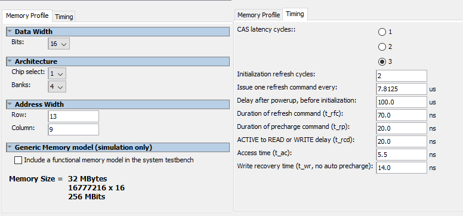

# Pocetak rada na projektu
[<< Nazad na pocetak](../README.md)\
Datum: 15.12.2018.
Tag: v0.1

Napravljen je procesorski sistem i testiran je Hello World program. Ovaj sistem ce se koristiti u daljem radu.

Problemi koji su se pojavili:
- razlika izmedju SD RAM na DE1-SoC ploci koja se koristi na vezbama i D0-Nano koja se koristi na projektu. Kao posledica ove razlike potrebno je promeniti podesavanja za SD RAM kontroler unutar Platform Designera. Validna podesavanja su pronadjena na Intelovom forumu na linku https://forums.intel.com/s/question/0D50P00003yyQvTSAU/sdram-on-de0nano-board?language=en_US i izgledaju kao na slici 1.\

Rezultat ove faze je uspesno javljanje procesora preko konzole ispisom Hello World poruke.
